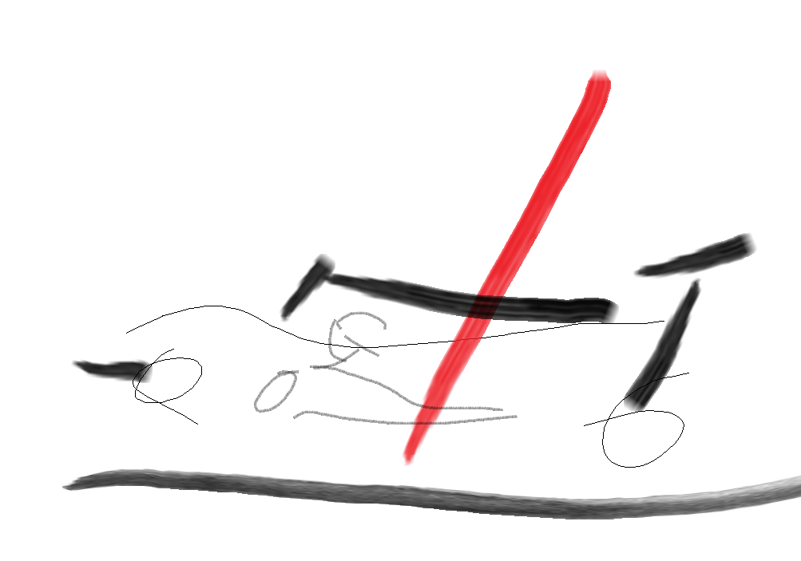

  
  <h1 align="center"> <ruby>Inferno<rt>インフェルノ</rt> Racing<rt>レーシング</rt> WITH ME<rt>ウイズミー</rt> </ruby> </h1>

インフェルノ・レーシング・ウィズミーは自動車工房MYSTが開発した最新フォーミュラマシン 「MYST KK-F」 を使用し、レース活動を通じて4輪レーシングマシンの詳細なデータを解析します。 特にシャシーセッティングやエレクトロニクスセッティングに関する情報を積極的に公開することで、モータースポーツファンやエンジニアリングを志す方々とともに、 「4輪のドライビングおよび車体設計」 について深く学び、その知見を共有していくことを最大の目的としています。 

## 参戦体制
**チーム名:** Inferno Racing WITH ME   
**ドライバー:** Christopher Dewan クリストファー・デワン  
**チームディレクター&テストドライバー:** 石川 朗   
**チームプロデューサー&テストドライバー:** 丸山 浩   
**参戦カテゴリー:** FJ1500   
**使用マシン:** MYST KK-F   

## FJ1500とは？
FJ1500は、モータースポーツの入門カテゴリーとして重要な役割を担うことが期待されており、 
当チームはこの新カテゴリーでの活動を通じて、その発展にも貢献してまいります。 インフェルノ 
・レーシング・ウィズミーの挑戦にご期待ください。 

## お問い合わせ
株式会社 WITH ME 〒123-0864 東京都足立区鹿浜7-11-3   
TEL: 03-5838-7397 FAX: 03-5838-7398   
https://www.withme-racing.com   

